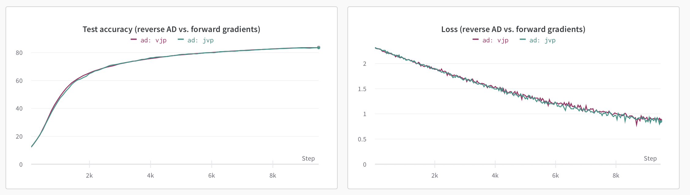

# Gradients without Backpropagation - JAX Implementation

This repository contains a JAX implementation of the methods described in the paper [Gradients without Backpropagation](https://arxiv.org/abs/2202.08587)

Sometimes, all we want is to get rid of backpropagation of errors and estimate unbiased gradient of loss function during single inference pass :)

## Overview

The code demonstrates how to train a simple MLP on MNIST, using either forward gradients (described as $(\nabla f(\boldsymbol{\theta}) \cdot \boldsymbol{v}) \boldsymbol{v}$) calculated by JVP (Jacobian-vector product, forward AD) or traditional VJP (vector-Jacobian product, aka reverse AD) methods. To investigate how stable and scalable the forward gradients method is (as the variance of the estimate is proportional to the number of parameters), you can increase `--num_layers` parameters.





## Requirements

- JAX <3
- optax (for learning rate scheduling)
- wandb (optional, for logging)

## Usage

To run the code and replicate MLP training with forward gradients on MNIST, simply execute the `train.py` :

```bash
python train.py
